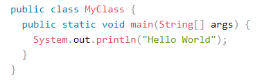
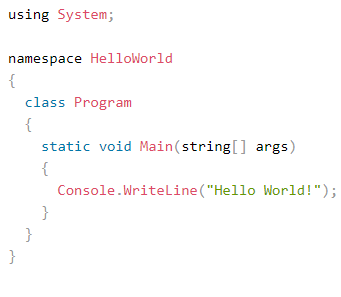

# Entry 2
##### 11/15/19

Throughout the three weeks after the first blog entry, my partner and I decided to indulge ourselves in the world of Unity. For two week, we accessed and tested different games made with Unity. This is because we were curious in how much of a variety of games can be created with Unity. 

We put our observation skills to the test, looking through many different genres of games. We played action, adventure, horror, RPG, and many other types of games on our school Mac. Outside of school, I tested different games on my PC to see the functionality of unity on the Windows Operating System. For a few days, Jagger and I questioned the limitations of Unity, if the program struggled on loading or running elements from the games we tested. Based on our discussions and observations, we concluded that an extremely large amount of game genres can be created and played on Unity. No issues persist for any of the games tested.

**VS**
   

After we confirmed that versatility and reliability of the program, Jagger and I decided to learn how to use Unity and the programming language associated with it, C#. We first looked onto different websites that discussed C#. We quickly realized that the syntax is very similar to Java. This connection allowed us to quickly absorbed and understand few of the topics of C# discussed, such as loops and basic conditionals.

Next, we accessed the official website of Unity to learn how we can implement C# into the program. As expected, there were many unfamiliar things we were exposed to: lightrooms, storing game objects into a variable like a boolean, frames, etc. Although Unity has a straight forward interface, the code was very confusing. As a result, Jagger and I are planning to spend a-lot of our time on learning how to use Unity with C# until we feel comfortable enough to create our game.

**As of 11/15/19, Jagger DU'go & Yahia Elhag still continue to use Unity for their freedom project**

Sources:

* https://unity3d.com/learning-c-sharp-in-unity-for-beginners
* https://itch.io/games/made-with-unity
* https://www.w3schools.com/cs/

[Previous](entry01.md) | [Next](entry03.md)

[Home](../README.md)
